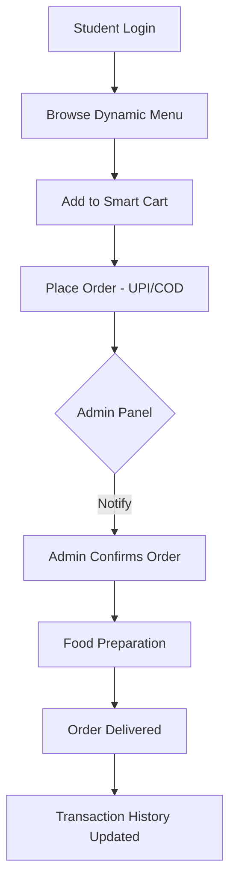

# 🍽️ DronaTeen – Smart College Canteen Management System

<div align="center">
  
  
  
</div>

---

## 🌟 Overview
**DronaTeen** is a high-performance, full-stack ecosystem designed to transform traditional college canteens into smart, digital hubs. By integrating real-time order tracking, dynamic inventory management, and secure student authentication, DronaTeen eliminates long queues and manual errors, ensuring a premium experience for both students and canteen staff.

> "Empowering campuses with digital innovation, one order at a time."

---

## ✨ Features

### 👨‍🎓 Student-Centric Experience
*   **Intuitive UI**: A responsive, modern interface built for speed and ease of use.
*   **Dynamic Menu**: Real-time product availability with high-quality images and pricing.
*   **Smart Cart Management**: Effortlessly manage quantities and view instant totals.
*   **Order History**: Transparent tracking of all past purchases and current status.
*   **Personalized Profiles**: Securely store Canteen ID, Roll Number, and contact details.
*   **Dual Payment Modes**: Support for Digital (UPI/Card tracking) and Cash on Delivery.

### 🛡️ Admin Command Center
*   **Visual Analytics**: Real-time revenue charts and order distribution using **Chart.js**.
*   **Advanced User Control**: Manage user permissions, promote admins, or audit student accounts.
*   **Order Lifecycle Management**: Transition orders from `Pending` → `Confirmed` → `Delivered` with one click.
*   **Dynamic Inventory (CRUD)**: Instantly add, update, or archive products without touching code.
*   **Intelligent Alerts**: Automated SMTP-based email notifications for critical system events.

---

## 🏗️ How it Works (System Workflow)



---

## 🛠️ Technical Excellence

| Layer | Technology | Key Usage |
| :--- | :--- | :--- |
| **Frontend** | Vanilla JS / CSS3 | Zero-dependency, ultra-fast loading & custom glassmorphism UI. |
| **Backend** | Node.js / Express | Scalable REST API with robust error handling. |
| **Database** | MongoDB | NoSQL flexibility for complex order and user schemas. |
| **Security** | JWT & Bcrypt | Military-grade password hashing and stateless authentication. |
| **Monitoring** | Helmet & Rate Limit | Protection against XSS, Clickjacking, and DDoS attempts. |
| **Email** | Nodemailer | Reliable SMTP delivery for system alerts. |

---

## 📂 Project Architecture

```bash
DronaTeen/
├── 📁 backend/                # The Brain (REST API)
│   ├── server.js             # Core server logic & Socket-ready
│   ├── seed.js               # Smart database initialization
│   ├── .env                  # Secure configuration
│   └── package.json          # Dependency manifest
├── 📁 frontend/               # The Beauty (UI/UX)
│   ├── index.html            # Main marketplace
│   ├── dashboard.html        # Student portal
│   ├── admin.html            # Admin dashboard
│   ├── style.css             # Premium Design System
│   └── script.js             # Asynchronous state management
└── README.md                 # Project Blueprint
```

---

## 🚀 Getting Started

### 1. Prerequisites
*   Node.js (v16.x or higher)
*   MongoDB Atlas Account
*   Gmail App Password (for email notifications)

### 2. Quick Setup
```bash
# 1. Clone & Enter
git clone https://github.com/Amit030705/DronaTeen.git
cd DronaTeen/backend

# 2. Install Core Dependencies
npm install

# 3. Configure Environment
# Create .env and paste your credentials
```

### 3. Environment Template
```env
PORT=3000
MONGODB_URI=mongodb+srv://<user>:<pass>@cluster.mongodb.net/dronateen
JWT_SECRET=your_super_secret_key
EMAIL_USER=your_email@gmail.com
EMAIL_PASS=your_gmail_app_password
ADMIN_EMAIL=recipient@gmail.com
```

### 4. Run Development Server
```bash
npm run dev
```

---

## 🗺️ Future Roadmap
- [ ] **QR Code Integration**: Scan to collect food at the counter.
- [ ] **Mobile App**: Cross-platform Flutter/React Native application.
- [ ] **SMS Notifications**: Real-time SMS alerts for order updates.
- [ ] **Inventory Prediction**: AI-based suggestions for stock management.
- [ ] **Loyalty Points**: Reward system for frequent student orders.

---

## 🤝 Contributing & Community
We believe in the power of open-source! 
1. **Fork** the repository.
2. **Feature Branch**: `git checkout -b feature/NewInnovation`.
3. **Commit**: `git commit -m 'Add some NewInnovation'`.
4. **Push**: `git push origin feature/NewInnovation`.
5. **PR**: Open a Pull Request for review.

---

## 👨‍💻 Developed By
**Amit Kumar**  
*Full Stack Developer & Campus Innovator*

[](https://github.com/Amit030705)
[](https://www.linkedin.com/in/amit-kumar-3070/)

---

## ⭐ Show Your Support
If **DronaTeen** helps you or your campus, please consider giving it a **Star** on GitHub. It motivates us to keep building!

---
<div align="center">
  <p>Built with ❤️ for a Smarter Campus Experience.</p>
  <p>© 2024 DronaTeen Project</p>
</div>
